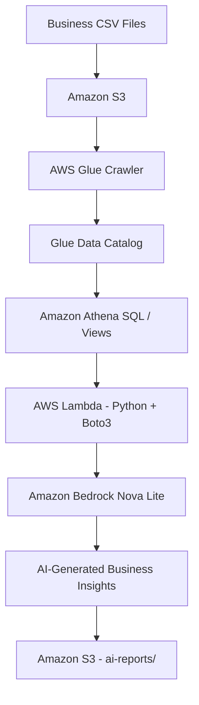

# AWS AI-Powered Business Analytics Platform

An end-to-end serverless data analytics project that transforms business CSV data into AI-generated insights using Amazon S3, AWS Glue, Amazon Athena, AWS Lambda, and Amazon Bedrock Nova Lite.

## Architecture



## Project Overview

The platform processes structured business data stored as CSV files. AWS Glue discovers the data schema and maintains metadata in the Glue Data Catalog. Athena performs SQL-based analytics, and Lambda coordinates the workflow. The resulting analytics are sent to Amazon Bedrock Nova Lite to generate a natural-language business report, which is saved back to S3.

## AWS Services Used

| Service | Purpose |
| --- | --- |
| Amazon S3 | Stores source CSV files, Athena query results, and generated reports |
| AWS Glue Crawler | Discovers schemas from source data |
| AWS Glue Data Catalog | Stores database and table metadata |
| Amazon Athena | Runs SQL queries and analytics views |
| AWS Lambda | Orchestrates the workflow using Python and Boto3 |
| Amazon Bedrock Nova Lite | Generates natural-language business insights |
| AWS IAM | Controls service permissions |
| Amazon CloudWatch Logs | Captures Lambda execution logs |

## Implementation Configuration

| Component | Configuration |
| --- | --- |
| AWS Region | `ap-south-1` (Mumbai) |
| S3 Bucket | `ai-business-analytics-kunal-2026` |
| Glue Database | `business_analytics_db` |
| Glue Tables | `customers`, `orders`, `order_items`, `products` |
| Athena Views | `category_sales_summary`, `monthly_sales_summary` |
| Lambda Function | `AI-Business-Analytics` |
| Lambda Execution Role | `AI-Business-Analytics-role` |
| Bedrock Inference Profile | `apac.amazon.nova-lite-v1:0` |
| Report Prefix | `ai-reports/` |

> Replace account-specific resource names with your own values when reproducing the project. Keep the bucket private.

## End-to-End Workflow

1. Upload business CSV files to a private S3 bucket.
2. Run the AWS Glue Crawler against the raw-data prefix.
3. Glue updates the Data Catalog with discovered schemas and tables.
4. Athena queries the cataloged data and uses analytics views.
5. Lambda starts an Athena query and checks its execution status.
6. Lambda retrieves query results and prepares a compact prompt.
7. Amazon Bedrock Nova Lite generates a natural-language analysis.
8. Lambda saves a timestamped `.txt` report under the S3 `ai-reports/` prefix.
9. Lambda returns the report location and Athena query ID.

## Repository Structure

```text
aws-ai-business-analytics/
├── README.md
├── lambda/
│   └── lambda_function.py
├── sql/
│   ├── category_sales_summary.sql
│   └── monthly_sales_summary.sql
├── data/
│   └── README.md
├── docs/
│   └── project-guide.txt
└── .gitignore
```

This is a suggested layout. Add the actual Lambda source code and SQL files used in your implementation. Do not commit customer data, AWS credentials, account IDs, or generated private reports.

## Configuration

Update these values to match your AWS resources:

```python
REGION = "ap-south-1"
DATABASE = "business_analytics_db"
TABLE = "category_sales_summary"
BUCKET = "<your-s3-bucket>"
OUTPUT_PREFIX = "ai-reports/"
MODEL_ID = "apac.amazon.nova-lite-v1:0"
```

Use a Lambda execution role for AWS access. Do not hardcode access keys or secrets in source code.

## Setup Guide

### 1. Create the S3 Bucket

1. Create an S3 bucket in your selected AWS Region.
2. Keep Block Public Access enabled.
3. Upload the source CSV files under a dedicated raw-data prefix.
4. Use separate prefixes for source data, Athena query results, and generated reports.

Example prefixes:

```text
s3://<your-s3-bucket>/raw-data/
s3://<your-s3-bucket>/athena-results/
s3://<your-s3-bucket>/ai-reports/
```

### 2. Configure AWS Glue

1. Create the Glue database `business_analytics_db`.
2. Create a crawler targeting only the raw CSV prefix.
3. Assign a Glue service role with the required Glue and S3 permissions.
4. Run the crawler.
5. Verify that the expected tables and schemas appear in the Data Catalog.

### 3. Configure Amazon Athena

Set the Athena query result location to:

```text
s3://<your-s3-bucket>/athena-results/
```

Select the `business_analytics_db` database, inspect the source data, and create or verify the analytics views:

- `category_sales_summary`
- `monthly_sales_summary`

Validate joins, grouping logic, and calculations against the source tables before relying on the reported totals.

### 4. Configure Amazon Bedrock

1. Confirm that Amazon Nova Lite is available for your account and selected Region.
2. Use the inference profile ID `apac.amazon.nova-lite-v1:0` if it is enabled for your account.
3. Ensure the Lambda execution role is allowed to invoke the selected model or inference profile.

Model access and regional availability can vary by account and Region.

### 5. Configure AWS Lambda

| Setting | Value |
| --- | --- |
| Runtime | Python 3.12 |
| Handler | `lambda_function.lambda_handler` |
| Function name | `AI-Business-Analytics` |

Configure the function with the correct Region, database, Athena view/table, S3 bucket, output prefix, and Bedrock inference profile. Attach an execution role with the permissions described in the IAM section.

### 6. Test the Lambda Function

Use this test event:

```json
{}
```

A successful invocation should return a status, the report location, and the Athena query ID. Open the returned S3 object to review the generated report.

## IAM Permissions

Follow the principle of least privilege. Depending on the implementation, the Lambda execution role generally needs:

- Athena query actions such as `StartQueryExecution`, `GetQueryExecution`, `GetQueryResults`, and optionally `StopQueryExecution` and `GetWorkGroup`.
- Glue Data Catalog read permissions for the relevant database, tables, and metadata.
- S3 permissions to read required inputs, access Athena query results, and write reports to the designated report prefix.
- `bedrock:InvokeModel` permission for the selected model or inference profile.
- CloudWatch Logs permissions for creating log streams and writing execution logs.

Restrict permissions to the required resources wherever practical. Avoid broad policies such as `AdministratorAccess`.

## Validation and Limitations

- Athena query results may include a header row. Remove it before constructing the model prompt.
- Validate numerical aggregates in Athena. AI-generated text is not a replacement for data validation.
- Check table join keys and IDs to prevent duplicated or inflated totals.
- Instruct the model to use only the supplied data and not invent metrics.
- Keep prompts compact to manage latency and model cost.
- EventBridge scheduling, email notifications, and dashboards are not implemented in this version.
- Amazon QuickSight was intentionally not included.

## Cost and Security

AWS services used in this project may incur charges, including S3, Athena, Glue, Lambda, CloudWatch Logs, and Bedrock. Review current pricing for your Region and configure an AWS Budget or billing alert.

Keep S3 buckets private, never commit credentials or secrets, and do not send sensitive customer information to a model unless you have appropriate authorization.

## Future Enhancements

- EventBridge Scheduler for automated report generation
- Optional SNS email notifications
- Stronger data-quality checks and structured report output
- More granular IAM policies and operational monitoring
- Optional analytics dashboard

## Interview Summary

"I built an AWS AI-powered business analytics pipeline. Business CSV data is stored in Amazon S3 and cataloged using AWS Glue. Amazon Athena performs SQL analytics, while AWS Lambda orchestrates the workflow using Python and Boto3. Lambda sends the query results to Amazon Bedrock Nova Lite through an inference profile and saves the generated report back to S3. I validated the end-to-end workflow with a successful Lambda execution."

## Author

Kunal Jadhav

- GitHub: [devkunaljadhav](https://github.com/devkunaljadhav)
- LinkedIn: [Kunal Jadhav](https://www.linkedin.com/in/devkunaljadhav/)

**GitHub Repository Name:** `aws-ai-business-analytics`

**Repository Description:**

```text
AWS AI-powered Business Analytics using S3, Glue, Athena, Lambda, and Amazon Bedrock Nova Lite to generate automated business insights and reports.
```
